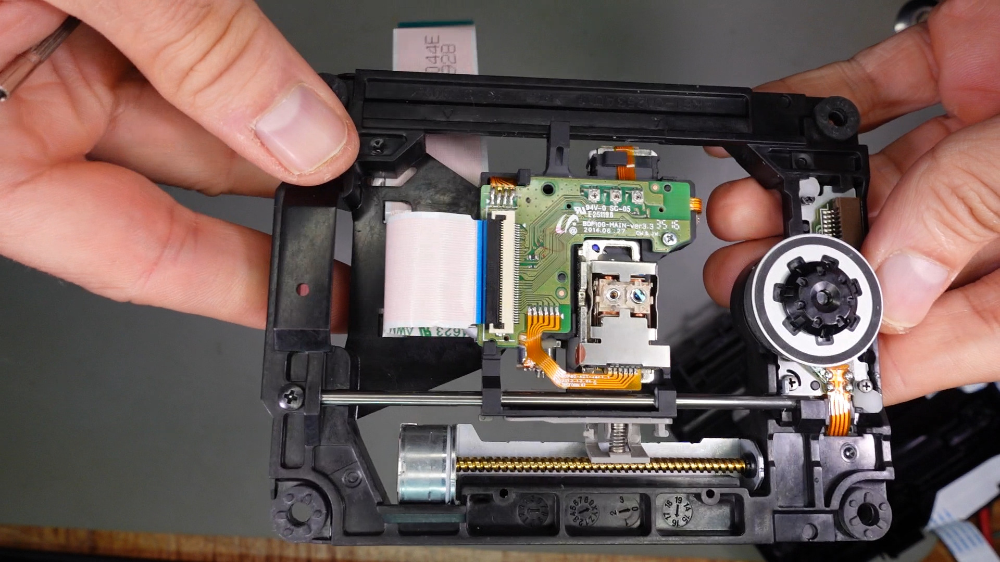
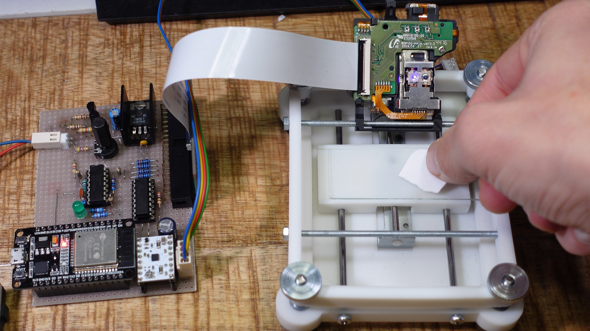
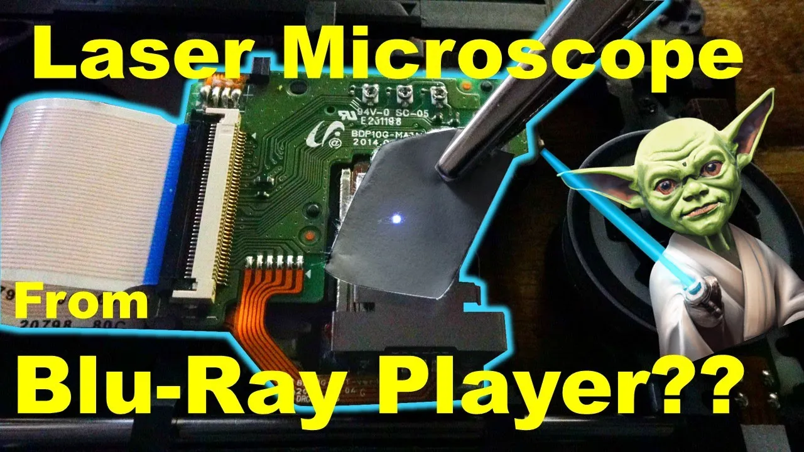
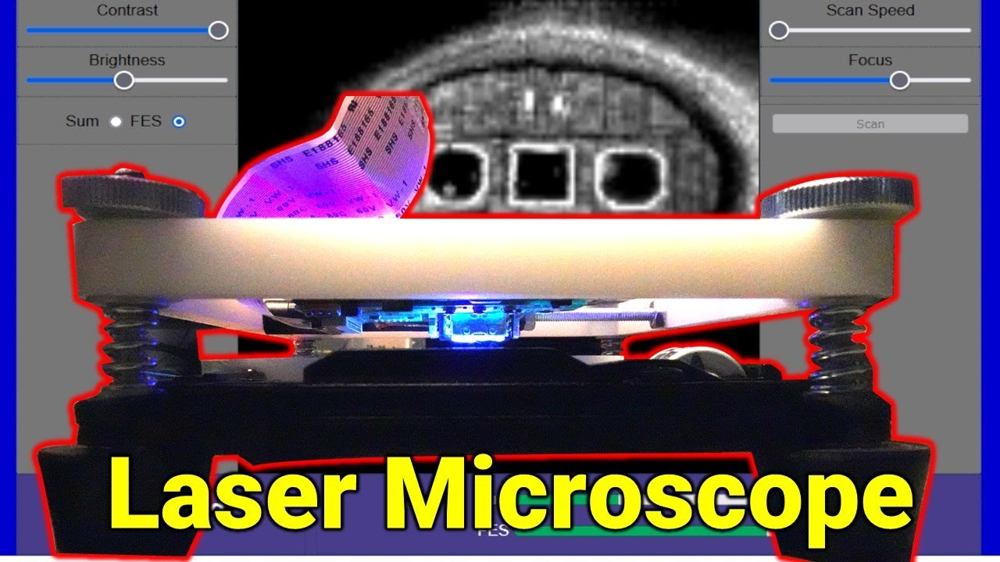
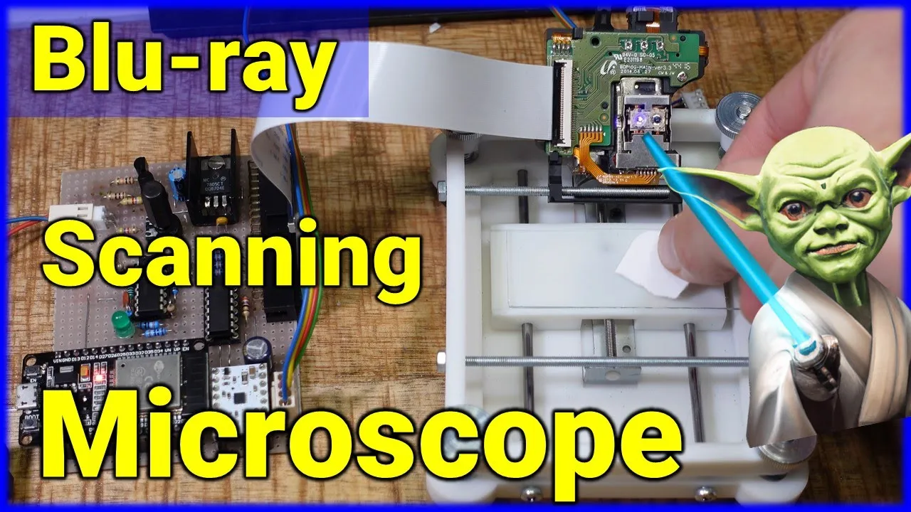

# Blu-ray Laser Microscope
In a way, CD-ROM and Blu-Ray drives already function like microscopes, using lasers to read the microscopic pits and lands on the surface of a CD or DVD. In the case of a Blu-Ray drive, an ultra precise blue (technically closer to violet in color) laser with a wavelength of 405 nanometers is focused on the surface of a disc, and how effectively that light is reflected back to the drive’s optical pickup unit determines whether a one or a zero has been detected.
*Combined CD/DVD and Blu-ray optical pickup unit used in the project (BDP-10G)*</img>

But the sensors in the optical pickup unit can actually measure a wider range of light intensities—not just on or off— which facilitates a Blu-Ray drive’s error correction capabilities, and allows for the hardware to be repurposed for other uses. This is about repurposing a Blu-Ray pickup to build a simple scanning laser microscope. 
*CD/DVD/Blu-ray drive with pickup from Samsung BD-J5900*</img>

A couple of custom-designed and manufactured plastic parts create a scanning bed for a sample that could move back in forth in one Y-direction (frame), while the laser itself shifted back and forth in x-direction (lines) by its surrounding "voice" coils.
*Scanning bed with electronics*</img>

Unlike an optical microscope, where the entirely of an object is imaged at once, a scanning laser microscope takes light intensity measurements in increments, moving across an object in a grid and assembling a magnified image pixel by pixel. 
A browser-based user interface written in HTML an Java Script allows to operate the device over WLAN.
*Web interface of Blu-ray microscope, showing onion cells*</img>

## Important Note
**The ESP32 API has changed from versions 2.X (based on ESP-IDF 4.4) to version 3.0 (based on ESP-IDF 5.1) of the Arduino ESP32 core. Use version 2.X or try the migrated branch.
Find more information here: [Migration from 2.x to 3.0](https://docs.espressif.com/projects/arduino-esp32/en/latest/migration_guides/2.x_to_3.0.html)**

---
## Preparing The Microscope
- Enter WLAN SSID and passphrase into the source code file `src.ino` and upload to ESP32 module.
- Copy `index.htm` and `opencv.js` to any directory on your PC and open `index.html` in your web browser.
- Adjust the reference voltage for the op-amps with Trimmer RV1 until the LED goes off and the level indicator on the bottom of the user interface shows a minimum.
- Adjust the current through the stepper motor with the trimmer on the STSPIN 220 driver module while the Up or Down button on the website is pressed until the object sled just moves smoothly. Warning: Too much current will overheat and burn the motor out.
- Place a slide in the recess of the specimen slide and a piece of paper on it. Flip down the OPU and turn the thumbscrews until the LED lights up.
---

## Taking Images
- Set the laser power and focus controls to their full extent
- Peep through the pickup lens from above and carefully position the specimen by hand and with the Up and Down buttons on the web interface until it is correctly placed.
- Slowly turn back the coarse focus control until the indicator swings out. Then adjust it with the fine focus control and the laser power control until it deflects about halfway.
- Perform a trial scan at low resolution and high scan speed. You can also adjust the parameters during the scan.
- Now try higher resolutions and/or lower scan speed and/or samples per dot to get a higher image quality.
  
---
## Watch Videos to Learn More
In Part one you will learn how I re-engineered an optical pickup unit from a broken Blu-ray player so that it can be used for a laser scanning microscope.  

<a href="https://youtu.be/liGuhbFh4IQ" alt="DIY Blu-Ray Laser Scanning Microscope #1: Making a Laser Microphone">
</img>
</a>  

---
Part 2 is about a working prototype that builds on the existing CD/DVD/Blu-ray drive I salvaged from the Blu-ray player.  
<a href="https://youtu.be/Hkialty_8K4" alt="DIY Blu-Ray Laser Scanning Microscope #2: Shooting Images">
</img>
</a>

---
Part 3 shows how to build an improved version of the microscope from 3D printed parts and how to use it.  
<a href="https://youtu.be/xfuWbnMYOos" alt="DIY Blu-Ray Laser Scanning Microscope #3: Improvements And Tests">
</img>
</a>
